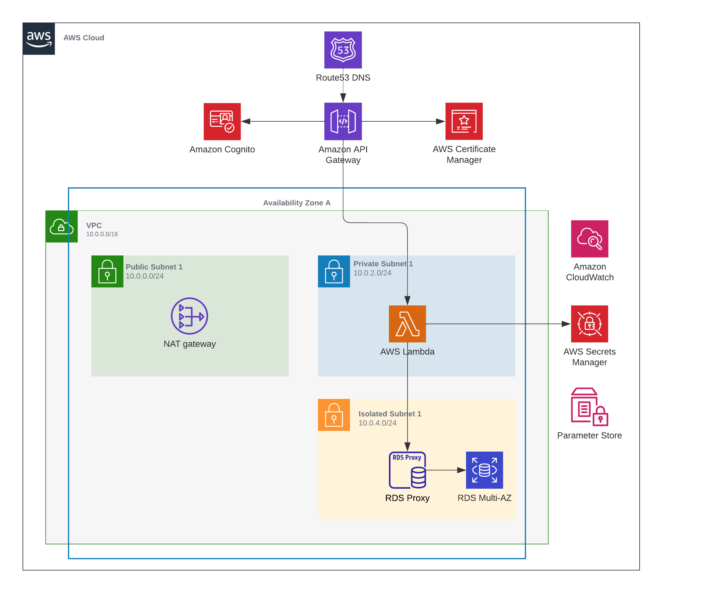

# AWS CDK 2024

## Case #1: Lambda Functions



- VPC + 3 subnets (public, private, isolated)
- Cognito
- RDS Aurora Postgres + Proxy
- API Gateway HTTP
- Lambda

## Getting Started

1. Install AWS CDK

   ```bash
   npm install -g aws-cdk
   cdk --version
   ```

2. Initialize a new project

   ```bash
   cdk init app --language typescript
   npm i esbuild
   ```

   _Note: `esbuild` - used to build Node.js Lambda functions_

3. Bootstrap the AWS environment

   ```bash
   cdk bootstrap
   ```

4. Deploy the stack

   ```bash
   cdk deploy --all
   ```

   or

   ```bash
   cdk deploy api
   ```

## File Structure

- `bin` - Entry point
- `lib` - Stacks and Constructs
- `helpers` - Reusable code
- `functions` - Lambda functions
  - `api-chats` - Lambda function for API Gateway
  - `shared` - Shared code between functions

## Useful AWS CLI Commands

- Change Cognito user password

  ```bash
  aws cognito-idp admin-set-user-password \
     --user-pool-id <XXX> \
     --region <XXX> \
     --username <XXX> \
     --password <XXX> \
     --permanent
  ```

- Get Cognito user JWT token

  ```bash
  aws cognito-idp initiate-auth \
     --client-id <XXX> \
     --region <XXX> \
     --auth-flow USER_PASSWORD_AUTH \
     --auth-parameters USERNAME=<XXX>,PASSWORD=<XXX>
  ```
